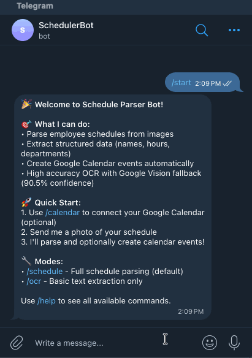

# Schedule Parser Bot

A personal productivity tool that automatically extracts my Lucky Supermarket work shifts from schedule photos and syncs them to Google Calendar. Built as a learning project to practice API integrations, OCR processing, webhook handling, and agentic coding with [Claude Code](https://claude.com/claude-code).

## 📱 See It In Action



_Complete workflow: Upload schedule photo via Telegram → OCR processing → Google Calendar sync_

## 🚀 Features

- **📸 Photo Upload**: Send schedule photos directly to Telegram bot
- **🔍 High-Accuracy OCR**: 96.4% confidence using Google Cloud Vision API
- **📅 Auto Calendar Sync**: Creates Google Calendar events with proper timezones
- **🎯 Personal Filtering**: Extracts your shifts from team schedules
- **🔐 Secure OAuth**: One-click Google Calendar authentication
- **⚡ Fast Processing**: ~5-6 seconds per schedule photo

## 📋 How It Works

### Input: Lucky Supermarket Schedule


_Employee schedule table with dates, shifts, and departments_

### Processing Pipeline

```
📱 Telegram Photo Upload
        ↓
🔍 Google Cloud Vision OCR (96.4% accuracy, ~5-6s)
        ↓
📊 Spatial Table Reconstruction (80% extraction success)
        ↓
📅 Schedule Parsing (Extract ALL employees, dates, times, shifts)
        ↓
🎯 Personal Filtering (Create events only for Joezari Borlongan)
        ↓
🔐 Auth Check (Google Calendar OAuth connection)
        ↓
📅 Calendar Event Creation (Batch processing with reminders)
        ↓
✅ Confirmation (Success message with event details)
```

**Simple Workflow:**

1. Send your schedule photo to the Telegram bot
2. Bot extracts and parses all employee schedules (including yours)
3. Automatically creates Google Calendar events for your shifts only
4. Get confirmation with event details

_First time? Use `/calendar` command to connect your Google Calendar_

## 🎯 Why This Project?

**The Problem**: Manually transferring Lucky Supermarket work schedules from paper/photos to Google Calendar is tedious and error-prone.

**The Solution**: Automate it! Upload a photo via Telegram, get calendar events in ~5 seconds.

**The Learning**: Built to practice:

- OCR processing with Google Cloud Vision API
- Telegram Bot API and webhook handling
- Google Calendar API OAuth and event management
- TypeScript, Express.js, and testing with Jest
- Agentic coding workflows with [Claude Code](https://claude.com/claude-code)

## 🔮 Future Potential

While the current MVP creates calendar events only for my shifts, the architecture **already extracts ALL employee schedules** from the photo during OCR processing.

**What This Means**:

- The bot reads and parses the entire team schedule
- All employee names, departments, and shift times are extracted
- Personal filtering happens at the calendar creation stage, not during parsing

**Potential Future Features**:

- **Team Calendar Invitations**: Switch from `PERSONAL_CONVERSION_OPTIONS` to `DEFAULT_CONVERSION_OPTIONS` in `scheduleToCalendar.ts` to create events for the entire team
- **Department Filtering**: Create events for specific departments (Meat, Produce, etc.)
- **Multi-User Support**: Different Telegram users can connect their Google Calendars and get their own filtered events
- **Schedule Sharing**: Export team schedules as ICS files or shared calendars

The architecture is ready for these features - it's just a configuration change away!

## 🛠️ Tech Stack

- **Backend**: Node.js, Express.js, TypeScript
- **OCR**: Google Cloud Vision API (primary)
- **Image Processing**: Sharp
- **APIs**: Telegram Bot API, Google Calendar API
- **Testing**: Jest (29/29 tests passing)
- **Database**: In-memory session storage

## 🔧 Prerequisites

- Node.js 18+ and npm
- Telegram Bot Token (from @BotFather)
- Google Cloud Platform account with:
  - **Google Cloud Vision API** (required for OCR - 96.4% accuracy)
  - **Google Calendar API** (required for calendar integration)
  - Service account key for Vision API authentication
- Basic knowledge of JavaScript/Node.js and TypeScript

## ⚡ Quick Start

1. **Clone the repository**

   ```bash
   git clone https://github.com/yourusername/schedule-parser-bot.git
   cd schedule-parser-bot
   ```

2. **Install dependencies**

   ```bash
   npm install
   ```

3. **Environment setup**

   ```bash
   cp .env.example .env
   # Edit .env with your API keys (see Configuration section)
   ```

4. **Start development server**
   ```bash
   npm run dev
   ```

## ⚙️ Configuration

Create a `.env` file with the following variables:

```env
# Server Configuration
PORT=3000
NODE_ENV=development

# Telegram Bot
TELEGRAM_BOT_TOKEN=your_bot_token_here
TELEGRAM_WEBHOOK_URL=your_webhook_url_here

# Google Calendar API (Required)
GOOGLE_CLIENT_ID=your_google_client_id
GOOGLE_CLIENT_SECRET=your_google_client_secret
GOOGLE_REDIRECT_URI=http://localhost:3000/api/calendar/oauth/callback

# Calendar Settings
CALENDAR_DEFAULT_TIMEZONE=America/Los_Angeles
CALENDAR_BATCH_SIZE=10
CALENDAR_CONFLICT_DETECTION=false

# Google Cloud Vision API (Optional - for 90.5% OCR accuracy)
GOOGLE_CLOUD_PROJECT_ID=your_project_id_here
GOOGLE_APPLICATION_CREDENTIALS=/path/to/service-account-key.json
GOOGLE_VISION_ENABLED=true
GOOGLE_VISION_QUOTA_LIMIT=1000
GOOGLE_VISION_USE_DOCUMENT_DETECTION=true
```

### Getting API Keys

#### Telegram Bot Token

1. Message @BotFather on Telegram
2. Use `/newbot` command
3. Follow prompts to create your bot
4. Save the token provided

#### Google Calendar API

1. Go to [Google Cloud Console](https://console.cloud.google.com)
2. Create new project or select existing
3. Enable Google Calendar API
4. Create OAuth 2.0 credentials
5. Add authorized redirect URIs

#### Google Cloud Vision API (Required for OCR)

1. Go to [Google Cloud Console](https://console.cloud.google.com)
2. Use same project or create new one
3. Enable **Cloud Vision API**
4. Create **Service Account**:
   - Go to IAM & Admin > Service Accounts
   - Click "Create Service Account"
   - Assign **Cloud Vision AI Service Agent** role
5. Generate **JSON Key**:
   - Click on service account > Keys > Add Key > Create new key (JSON)
   - Download and save securely (never commit to version control)
6. Set `GOOGLE_APPLICATION_CREDENTIALS` to the JSON file path

**💰 Cost**: Free tier provides 1,000 OCR requests/month
**🎯 Performance**: 96.4% OCR confidence with ~5-6 second processing time

For detailed setup instructions, see [GOOGLE_CLOUD_SETUP.md](./GOOGLE_CLOUD_SETUP.md)

## 📖 API Documentation

### Health Check

```
GET /api/health
```

### Telegram Integration

```
POST /api/telegram/webhook    # Bot webhook endpoint
POST /api/telegram/setup      # Register webhook
```

### Calendar Integration

```
GET  /api/calendar/auth/:telegramUserId        # OAuth URL
GET  /api/calendar/oauth/callback              # OAuth callback
POST /api/calendar/events                      # Create event
POST /api/calendar/events/batch                # Batch create events
GET  /api/calendar/status/:telegramUserId      # Auth status
GET  /api/calendar/calendars/:telegramUserId   # User calendars
DELETE /api/calendar/auth/:telegramUserId      # Revoke access
POST /api/calendar/test/personal-schedule      # Test endpoint
```

## 🧪 Development & Testing

```bash
# Start development server
npm run dev

# Run tests
npm test

# Run tests with coverage
npm test:coverage

# Test personal schedule filtering
curl -X POST http://localhost:3000/api/calendar/test/personal-schedule
```
